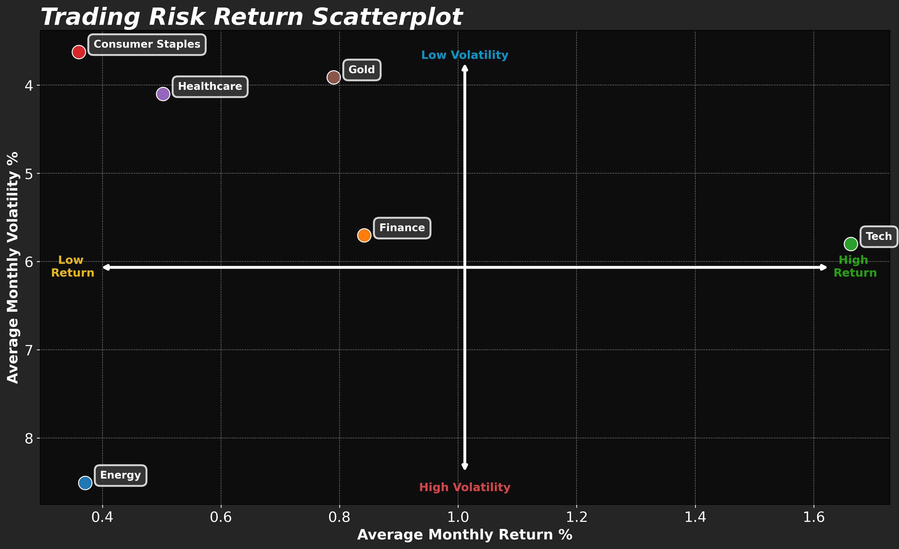

# **Equity Sector Risk-Return Anlysis**

## **Overview**
This project analyses 10 years of historical data across five major industry sectors — Energy, Healthcare, Consumer Staples, Tech and Finance — calculating average monthly return and volatility for each. Results are plotted on an interactive scatter plot for direct comparison, alongside popular alternative investments such as Gold and Bitcoin.
The chart includes quadrant annotations clearly indicating risk-return characteristics for each position, helping investors identify sectors suited to their risk tolerance. The finalised scatter plot is automatically saved as a PNG on execution.

## **Tools Used**
Python, NumPy, Matplotlib, CSV, Datetime, OS

## **How to Run**
Download all files into the same folder and run Trading Return Dash.py

Tech delivered the highest average monthly return at approximately 1.7% with moderate volatility of 6%, making it the standout performer over the 10-year period. Consumer Staples and Healthcare offered the greatest stability but at the cost of lower returns, both sitting below 0.5% average monthly return. Finance showed moderate performance but is directly outperformed by Tech, producing similar volatility with notably lower returns. Energy performed poorly overall, combining the highest volatility at over 8% with the lowest returns below 0.4% — the worst risk-adjusted outcome of all sectors analysed. Gold demonstrated consistent stability with volatility below 4% and reasonable average monthly returns of approximately 0.8%.

## **Key Findings**
- **High risk tolerance / long-term investors:** Tech is the optimal choice, delivering the highest average monthly returns with relatively moderate volatility
- **Low risk tolerance / short-term investors:** Consumer Staples, Healthcare and Gold are most suitable. Gold produces the best returns of the three while Consumer Staples offers the most stable price movement
